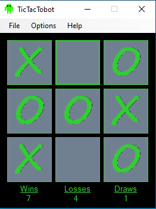
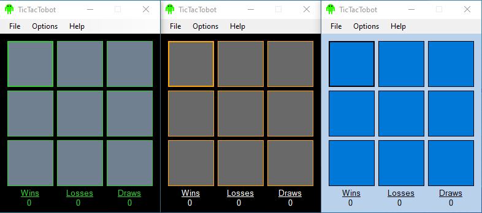

# TicTacTobot
---
## Description
A Tic-Tack-Toe game developed in C#.



## Gameplay
TicTacTobot is highly sophisticed computer program designed for one purpose. To destroy all humans who dare stand in it's way. TicTacTobot does not eat, he does not sleep, and he does not feel pain. He can not and will not show remorse. Are you ready to step into the ring and Tic to Tac against the champ? For the sake of the human race, lets hope so ...

- Challenge TicTacTobot at multiple levels of difficuly.
  - Recruit
  - Veteran
  - Nightmare
- Choose between multiple unique color themes!
- Defeat TicTacTobot enough times to unlock a secret gamemode!



## Installation
To challenge TicTacTobot, you can download the latest release or build the code from source.

### Download
You can download the latest release of TicTacTobot.exe from https://github.com/malwaredetective/TicTacTobot/releases/. 

### Building from Source Code
**NOTE: THIS WILL NOT WORK UNTIL I UPLOAD SOME ADDITIONAL FILE REQUIRED FOR THE PROJECT ...**

**TO DO: UPLOAD SOUND FILES REQUIRED FOR THE PROJECT**
- Clone a copy of the Github repository.
```
git clone https://github.com/malwaredetective/TicTacTobot.git
```
- Open **TicTacTobot.Sln** within Visual Studio.
- If necessary, you may need to download and install the latest version of  **Microsoft.VisualBasic.PowerPacks** using the Nuget package manager.
- Build the solution within Visual Studio. 
